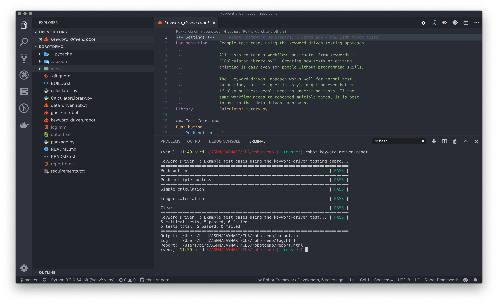
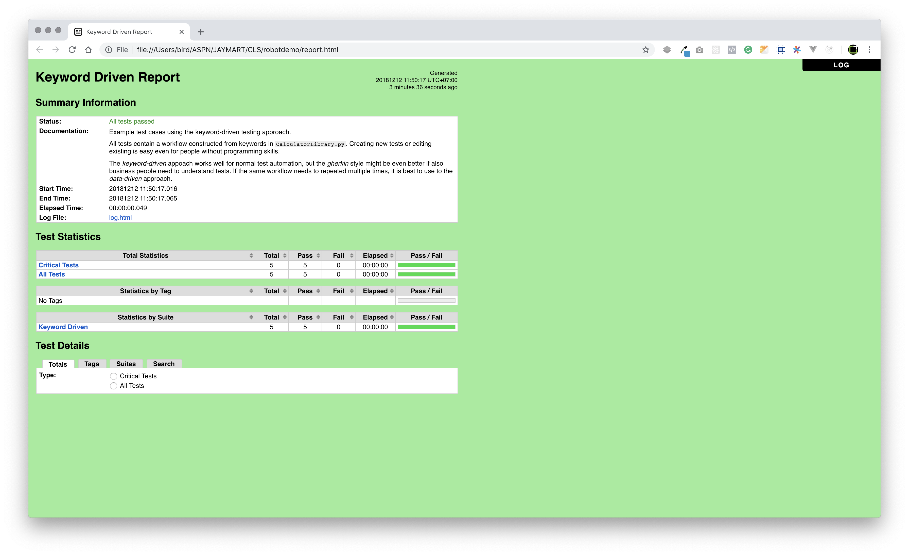
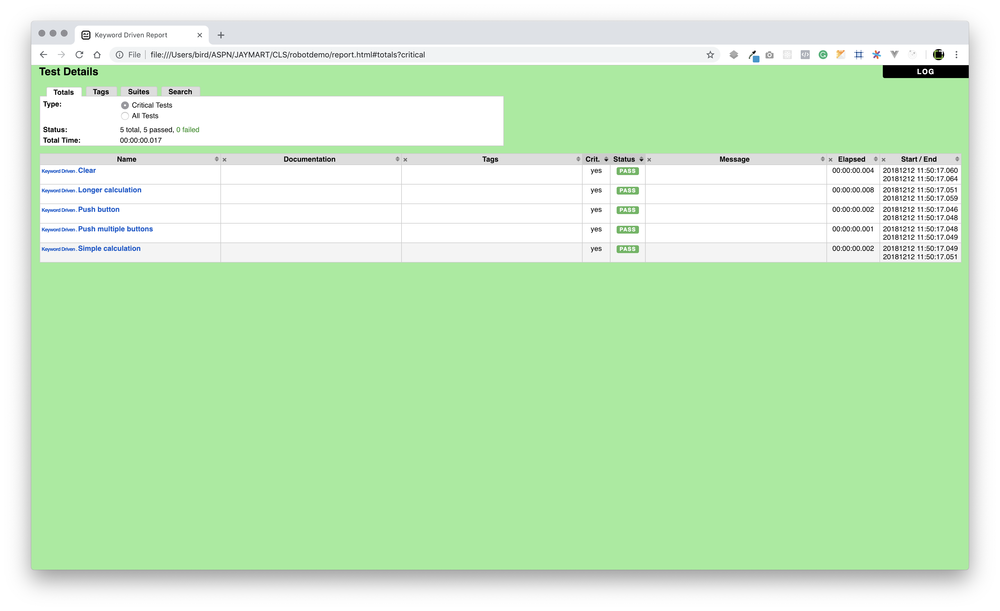
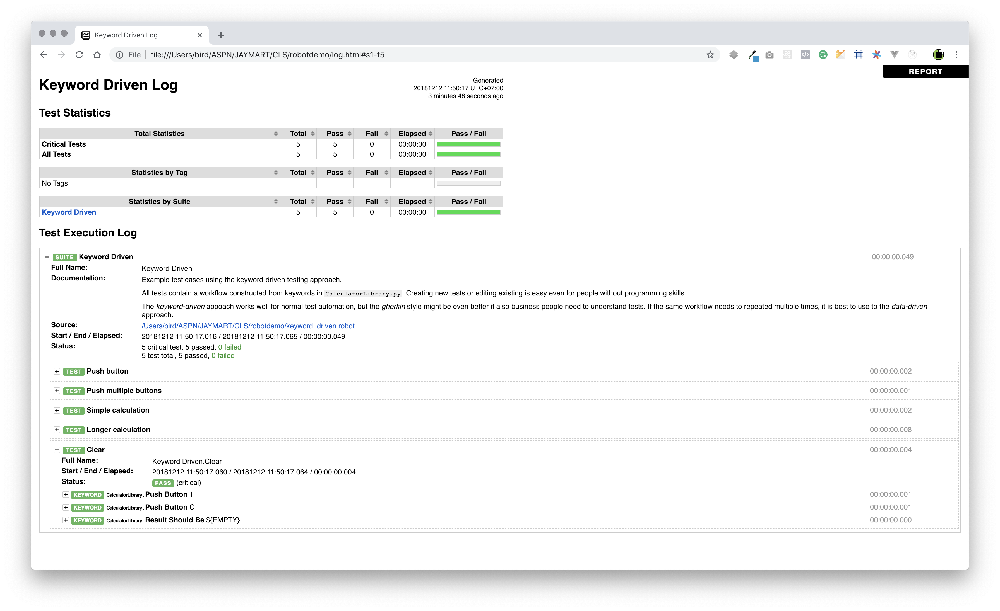

# Robot Framework Demo


## Terminal

`1. Create Virtualenv for workspace`

```bash
python3 -m venv venv
```


`2. Generate output suitable for a requirements file.`

```bash
pip freeze
```

`3. Generate a requirements file and then install from it in another environment.`

```bash
pip freeze > requirements.txt #Generate file
```

```bash
pip install -r requirements.txt #Install 
```

## VS Code

`Add config setting.json`

```json
{
    "python.pythonPath": "venv/bin/python"
}
```

## Robot Running tests 

```bash
robot keyword_driven.robot
```

```bash
robot --name Robot --loglevel DEBUG keyword_driven.robot data_driven.robot gherkin.robot
```

`Timestamp Outputs to Report`

```bash
robot --timestampoutputs --outputdir report --log mylog.html --reportNONE keyword_driven.robot
```

```bash
robot --timestampoutputs --outputdir report --log mylog.html --report report keyword_driven.robot
```

## Report



